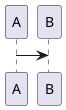

# 思考の断片 copyright:  kitfactory@gmail.com all rights reserved.

# ソフトウェアエンジニアの幸福学
## エンジニアのあなたの未来を考えよう。

# ソフトウェアの工房
## チームはソフトウェアの工房だ。

あなたのチームを一つの工房と考えてみよう。 
いろいろな作業をして一つのソフトウェアを出荷する工房だ。 
工房にはいろいろなタイプの人がいて、いろいろなタスクがあって、最後に一つのソフトウェア製品ができる。 
 
この本を読む間、ちょっとだけ、あなたのチームを工房と考えてみよう。 

# モノづくりの理論を知る旅

## ソフトウェアの工房もモノづくりの世界だった。

ソフトウェアの工房ではいろいろな文書や情報、プログラムを書いた。ソースコードやデータを扱っている。本当にたくさんの種類の情報だ。けれど、これらをマテリアルと呼んでみよう。そうすると、AさんからBさんにマテリアルを渡して、ソフトウェアという製品を作る。僕たち、チームはマテリアルをやりとりして製品を作る工房だと言える。

では、時計づくりの工房を見てみよう。時計工房でも部品というマテリアルをCさんからDさんへと渡していき、最後に時計が完成する。マテリアルを送って製品を作ることは変わりはない。

では、なぜ僕たちは同じようにモノづくりをしていたのに、ソフトウェア開発だけが特別で違うものだと考えているのだろう？

ソフトウェアは目に見えないものだから？少し待って。文書やデータのカタチにしているだろう？本当に目に見えないものでは、自分たちも作業できないよ。

では、特別にあつらえたデザインやソースコードが必要だから？少し待って。時計にだってクールな製品があって、特別に部品をあつらえることもある。

ソフトウェアも時計もマテリアルを渡して製品を作るという流れで見たら変わらない。ソフトウェアは特別だ、なんて言い訳なんて、どれも本質なんだろうか？

ハッキリ言おう。僕たちのチームはソフトウェアの工房でモノづくりをしている。作業の姿はあまりに違って見えるけれど、やっていることの意味は、ほとんど同じだったんだ。

## モノづくりの世界の理（ことわり）を識ろう。

モノづくりの歴史は人類の歴史だ。ヒッタイトが鉄器で中東を制した。16世紀のイタリア、ベネチアにはアーセナルという素晴らしい造船工場を持ち、その戦艦の製造力で世界に冠たる交易国を作り上げた。モノづくりは国の力でもあったんだ。

産業革命はイギリスが日の沈まぬ国となる発展をささえ、T型フォードもアメリカの発展、その後のモノづくり世界を大きく変えてきた。トヨタはカンバンやカイゼンに代表されるトヨタ生産方式を産み、日本の復興に大きな役割を果たし、Japan as No.1と呼ばれる時代を築いた。モノづくりの歴史は人類の歴史であり、人類の叡智なんだ。ソフトウェアの工房にだって使える智慧がたくさんあるはずなんだ。

モノづくりの世界の理（ことわり）を識ろう。そうすれば、いろいろな工場で考えてきたモノづくりの世界の理論が使うことができるはずだろう。

## 日本のモノづくりの歴史

日本のモノづくりの歴史は現在のアジャイルなどのソフトウェア開発に大きな影響を与えている。そこから確認してみよう。

## トヨタ生産システム

カンバン、カイゼンといった言葉は誰しもが耳にしたことがあるだろう。トヨタに如何にしてトヨタ生産システムが生まれたのだろうか、その歴史を振り返っておこう。

## リーン思想

トヨタ

## アジャイルの歴史

欧米に渡ったリーンの発想は、

## 直感と反する全体最適という存在

「ザ・ゴール」で説明されることの一つが大きな設備を投入し、効率化しても全体(スループット)は改善しないということだ。大量の処理がプロセス全体から見て一部でできるようになっても、仕掛品の在庫が積み上がってしまう。ボトルネックの箇所が改善されないからだ。

同様に作業員の手が空いてしまうことも恐れられる。だから、もっと仕事をさせ、どんどん作れば一時の安心が得られる。そして仕掛品の在庫を積み上げる。

人や設備が全ての能力を発揮していない場合に、徹底的に活用しようと考える。直感的には、その行為は正しい。しかし、その判断はあくまで部分にとっての最適な戦略である。在庫の山を生産している可能性がある。全体最適から見て、手が空きそうだからもっと生産すべきかどうかを見極めなくてはいけない。

この全体最適に反して部分最適化が行われる場合はニクラス・モディグ氏の「This is Lean.」という書籍でフロー効率性とリソース効率性として議論が行われている。

## リソース効率性/フロー効率性

ニクラス・モディグ氏のリソース効率性とは保有するリソースを最大限に利用しようとする効率性の観点を言う。一方でフロー効率性とは生産工程を流れる製品を最短にしようとする観点での効率化を指す。

具体例は病院の受診の例を考えよう。

効率性とは、そのバランスを配置した場所になる。そして、

## リソース効率性からフロー効率性

## TOC(Theory Of Constraint)との関係

「ザ・ゴール」などでエリヤ・ゴールドラット博士が説いたTOCと呼ばれる理論がある。制約の理論いう。プロセスが制約によって、

「アジャイルソフトウェアマネジメント」にも触れられている。

スループット/在庫/業務費用
統計的変動

## 学習でサービスをドライブする

## 数理的イメージ

# プロジェクトの環境

* プロジェクトの生態系
* プロジェクトの社会

## プロジェクトのできること/できないこと

## 心理的安全性

# 善意に包まれるプロジェクト

プロジェクトをメンバーの善意でなりたつようにしよう。
あくまで自然な善意で包まれるようプロジェクトへ導こう。

自由を許しながらメンバーを正しい方へと導こう、それはリバタリアン・パターナリズムという考え方である。
行動経済学の概念だけれど、プロジェクトなど殆どが人間の問題だから、使えないことはない。

リバタリアン・パターナリズムに採用されたナッジの考え方をプロジェクトに取り入れてみよう。
ナッジとは行動経済学で出てくる概念だが、ちょっと肘で突くことである。
ちょっと肘で突かれると、その人は正しい振る舞いをする。
そして、その結果が集積するとき、膨大な経済効果が得られる。
メンバーが少し善意を働かせるだけで、メンバーの業務は一つランクアップする。
その集積は膨大な経済効果を産む。

### イシューをテンプレートにする。
イシューにテンプレートが用意されると、作業が高速化するだけでなく、報告されるレポートの質を誘導することができる。

* イシューの作成粒度が玉石混交なので制御したい。
* イシューの結論や議論の内容が明確でない。

### プロジェクトの全体進捗を共有する。

進捗や出来は共有すべきことだと思う。
ガントチャートの形式では見えにくいからEVMや数値が良いだろう、あと残工数がどれだけとわかることが必要だ。
そのためにイシューやプロダクトを静的に解析していこう。
善意が全体の状況をメンバーと[Kibana](http://qiita.com/kitfactory/items/9c2f990d87e33fab828a)などを活用して、共有しよう。

その結果、チームに起きることはプロジェクトを完成へ向けて「あとこれだけだ、あそこがまずい」、
メンバーが主体的な取り組みを勇気づけることができる。

個人の進捗状況も共有しよう、誰が遅れているから悪いと評価するためではなく、メンバーの誰かが苦しんでいることを共有するために。
計測できないものは改善できない、共有できないものは改善できないのである。

* プロジェクトの全体進捗を

あなたはAをしろ、Bをしろと強制していないだろうか？
自然とそうするのが望ましい場合、メンバーはそうするのである。

## EVM(Earned Value Management)

モニタをするツールを充実させることは、ナッジの一つとして有効です。

## WBSを組み立てる

## 自工程完結とフロントローディング

## 継続的結合

## Kata-Project 継続的

# 人が育つ環境

## 精神性：改善が業務として行われ、加速していく組織

トヨタの分析をした著作として有名な著作に、ザ・トヨタウェイ、トヨタのカタという書籍がある。興味深いことに、その論理がとても似ているところがある。

この２冊の特徴はトヨタの強みをトヨタ生産方式という方法論(道具)の素晴らしさだけに求めないことだ。常に改善し続ける魂のような存在、それがトヨタウェイ、トヨタのカタだとされている。トヨタの生産性が成り立たせているものだと主張されている。つまり、方法論と精神面（マインドセット）の２重性があって、初めて成立するのがトヨタのカイゼンなのだ。

アジャイルでも同様なことがよく言われる。方法論の側面、精神的な側面の二重性がある。方法論はスクラム、カンバンなどの手法、ツールであり、それと同時にアジャイルマニフェストに見られるマインドセットのことだ。どちらか片側だけではうまくいかない。この２面性が必要だと、知る必要があると思う。

## ジョイ・オブ・ワーク

カイゼン、カイゼンで進めてもうまく行かない。日本のカイゼン活動はTQMと呼ばれているが、吉田耕作氏のジョイ・オブ・ワークではTQM活動の問題点について触れている。

## キーガンの発達心理学モデルとアジャイル

## メンバーの成長を促す

メンバーは経験とともに成長します。ロバート・キーガン博士の発達心理学によれば、メンバーは急激に成長する時期があり、その後、しばらくあるレベルを維持し、また次の成長があるといったように階段状の成長を辿ります。

### 成人段階の４レベル

| 段階 | 通称 | 概要 |
|:--|:--|:--|
|1|利己的段階|自分が世界の中心という考えで、相手のことは道具/手段として見なす段階、子どもに近い段階|
|2|慣習的段階|周りの|
|3|自己著述段階|自分の価値観を持ち、自分のことを表現できる段階|
|4|相互発達段階|自分の価値観に横たわる前提条件を考察し、深い内省を行いながら、 既存の価値観や 認識の枠組みを打ち壊し、新しい自己を作り上げていける|

この階段を考え、あなたの周りにいる人を何人か思い浮かべてみましょう。メンバーは今、どの段階にいるのかが分かり易いのではないでしょうか。

## 集合的オーナーシップ(Collective Ownership)とアジャイルの関係

製品を自分のものだというオーナーシップを持ったメンバーは製品全体の視点で意見を言います。時にはリーダーシップを発揮して問題を解決してくれます。とても好ましく、頼もしい存在です。が、なかなかその観点を持ったメンバーは貴重です。私は、この言葉をある方の講演で知りました。アジャイルでは、この考え方は、とても重要なのです。

ところが現実にみて、このレベルまで成長したメンバーはあなたの周囲にどれくらいいるでしょうか。

既存の情報を鵜呑みにするのではなく、 自分の頭でそれらを咀嚼し、自分なりに意味を再構築していくという、 これまでとは異なった新たな意味を生み出していけるような知性が求められる

加藤洋平. 組織も人も変わることができる！　なぜ部下とうまくいかないのか　「自他変革」の発達心理学 (Kindle の位置No.1665-1666).  . Kindle 版.

ステージ1の段階では、どのように感じるかを説明させ。
ステージ２の段階では、思考を言語化するように命じる。
ステージ３の段階では、意見をフィードバックし。

# 実際の問題を考える

# 哲学という概念の素材

あなたの

## オブジェクト指向の元祖のプラトン

プラトンはオブジェクト指向の師匠とも言えるべき存在に

## パターンのもとアリストテレス

プラトンの弟子、アリストテレスはある意味パターン派です。

## 後期ウィトゲンシュタイン：哲学探究

20世紀の哲学者の偉人にウィトゲンシュタインがいます。ウィトゲンシュタインには前期に論理哲学論考、後期に哲学探究という２つの大きな著作があります。

哲学探究

## A.I.の時代にむけて

これから5年から10年のうちに、ソフトウェアの開発、デザインは大きくツールが進歩する。そのときに、多くの人は人工知能をOSのように使い、その中で問われるのはパターンの編集能力、コミュニケーションをする力が問われるのではないかと思っています。

# kata-project
* redmineのAPIを利用できること
* GitLab Issueの修正
* GitHubの内容でAPIを利用できること

## 次フェーズでの価値

## 大きなスコープに対するユーザーから価値の低減

人間の価値はネガティブなものに対して大きく、

大きなスコープを持ったシステムは設計側の能力が一定とし、ユーザーを期待させるとしよう。

少し確率的に考えてみる。設計者を正規分布でデザイン解決力があるとしよう。正はよりよくデザイン解決できたという仮定で、負がでた場合に、

これを学習効果で引き戻すことができれば、

## プロスペクト理論

# 後編
* アジャイルの2面性-アジャイル形而上学-魂について

# プロジェクトという社会構築に向けて
* Joy of work：カイゼンの閉塞
* 社会制度設計
* フラストレーションのない自動化
* ナッジ

# 個人の成長が
* キーガンの発達心理学
* モノの見方を蓄える哲学という場
*

## ソフトウェア開発者としての幸福論

### ソフトウェア開発者としてあなたの未来
*

## 生活の糧としての仕事と負のループ

## ユーザーの幸せを幸せとするために

# 4.組織のリーン化を進める
## 4.1.人が育つ組織

## モノづくりの歴史
* トヨタ生産方式を学ぼう。

| 自働化 | |
|ジャストインタイム | |

根底にムダを徹底的に省く。

## 4.2.哲学は不変

## 4.3.人間の成長モデルに沿った成長戦略
### 4.3.1. アジャイルに必要なソフトウェア技術者の態度

## 集合的オーナーシップ(Collective Ownership)とアジャイルの関係

製品を自分のものだという、オーナーシップを持ったメンバーは製品全体の視点で意見を述べてくれるでしょう。時にはリーダーシップを発揮して問題を解決してくれる。とても好ましく、頼もしい存在です。アジャイルのプロジェクトがスキルの高いメンバーが必要というのは、これらの哲学、思想を実践してくれる行動者を必要とするからです。しかし、一方で

### 4.3.1.自分で考え、自分で動くとは？
### 4.3.2.

#### 4.2.自働化・省人化

工数を生み出すために、必要な取り組みの

#### 4.3. 悪循環メカニズム

チームだけの問題もあればチームの外部の問題もあるだろう。

# リーン化
##

#### 4.3.TOC/バリューストリームマップ

- 共通部品/レイヤード・アーキテクチャーの罠
- 上流工程の崩壊

#### 4.4.



