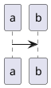

# 思考の断片 copyright:  kitfactory@gmail.com all rights reserved.

この本は数年から十年程度、ソフトウェア開発を経験してきた、あなたを想定して書かれた本です。あなたの人生にとって、一つの大きな転換点となるような、大きな智慧の旅となることを願って書かれた本です。この本に書かれる内容は、おそらく5年、10年で揺らぐような内容ではありません。この本で触れたアイデアは、あなたの中で人生を支える智慧として育ち、これから長いソフトウェア開発者としてのあなたの人生をより素晴らしいものにしてくれるでしょう。

この本では大きく２つの見方でソフトウェア開発の現場を考え、ソフトウェア開発の智慧を整理していきます。一つ目は工房としてソフトウェア開発現場です。ここではモノづくりを効率的に進めるとはどんなことなのかを考えてみたいと思います。

もう一つの見方は社会としてのソフトウェア開発現場です。ソフトウェアの現場の問題の多くは技術ではなく、協調の問題です。ソフトウェアの現場が一つの社会であることを理解しておくことが、あなたがより巨大なソフトウェアに取り組む上で必要な考え方は何かを考えてみます。

もちろん、どちらかの見方だけを強調しても上手く行きません。全ては均衡の上にあります。２つの見方をよく理解１して、現場と対話し、振り返って考えてみましょう。それらがあなたの智慧となり、あなたという樹木に実りを与えることでしょう。まずはソフトウェアを工房として考えてみることから、ソフトウェアの智慧の旅を始めましょう。

この本は、あなたが10年も20年も継ぎ足して使えるような智慧の獲得にむけて、基礎となる体験をするための智慧の旅路です。もし、あなたが技術者として幸せな人生を歩むことができれば、筆者の企みは成功です。あなたの笑顔を見て、しめしめとほくそ笑むことでしょう。それでは、あなたのソフトウェア開発者人生を最大の実りのあるものとするために、早速、旅路を始めようではありませんか。

# ソフトウェアの工房
## チームはソフトウェアの工房である。

まずは、あなたのチームを一つの工房と考えてみましょう。あなたのチームは、いろいろな作業をして一つのソフトウェアを出荷する工房だと考えてみてほしいのです。

工房にはいろいろなタイプの人がいて、いろいろなタスクがあって、最後に一つのソフトウェア製品ができます。

# モノづくりの理論を知る旅へ出よう。

## ソフトウェアの工房もモノづくりの世界だった。

ソフトウェアの工房ではいろいろな文書や情報、プログラムを書いたソースコードやデータを扱っています。本当にたくさんの種類の情報です。これらをマテリアルとして捉え、フロー・ユニットと呼んでみましょう。そうすると、AさんからBさんにマテリアルを渡して、ソフトウェアという製品を作る。僕たち、チームはマテリアルをやりとりして製品を作る工房だと考えてみよう。

では、時計づくりの工房を見てみよう。時計工房でも部品というマテリアルをCさんからDさんへと渡していき、最後に時計が完成する。マテリアルを送って製品を作ることは変わりはない。

では、なぜ僕たちは同じようにモノづくりをしていたのに、ソフトウェア開発だけが特別で違うものだと考えているのだろうか？

ソフトウェアは目に見えないものだから？少し待って。本当に目に見えない？文書やデータのカタチにしているだろう？本当に目に見えないものでは、自分たちも作業できなくなってしまう。

では、特別にあつらえたデザインやソースコードが必要だからソフトウェア開発は特別なのだろうか？いや、少し待って。時計にだってクールな製品があって、特別に部品をあつらえることもある。

ソフトウェアも時計もマテリアルを渡して製品を作るという流れで見たら変わらない。ソフトウェアは特別だ、なんて言い訳は本当に成り立つことができるのだろうか？

ハッキリ言おう。僕たちのチームはソフトウェアの工房でモノづくりをしている。作業の姿はあまりに違って見えるけれど、やっていることの意味は、ほとんど同じなんだと。

## モノづくりの世界の理（ことわり）を識ろう。

モノづくりの歴史は人類の歴史だ。遠い昔、ヒッタイトは製鉄技術を発展させ、鉄器で古代オリエントを支配した。16世紀のイタリア、ベネチアはアーセナルという素晴らしい造船工場を持ち、その戦艦の製造力で世界に冠たる交易国を作り上げた。モノづくりは国の力そのものだった。

産業革命はイギリスが日の沈まぬ国となる発展をささえ、T型フォードもアメリカの発展、その後のモノづくり世界を大きく変えてきた。トヨタはカンバンやカイゼンに代表されるトヨタ生産方式を産み、日本の復興に大きな役割を果たし、Japan as No.1と呼ばれる時代を築いた。モノづくりの歴史は人類の歴史であり、人類の叡智なんだ。ソフトウェアの工房にだって使える智慧がたくさんあるはずなんだ。

モノづくりの世界の理（ことわり）を識ろう。そうすれば、いろいろな工場で考えてきたモノづくりの世界の理論が使うことができるはずだ。

## 日本のモノづくりの歴史

驚くべきことに、日本のモノづくりの歴史は現在のアジャイルなどのソフトウェア開発や欧米のビジネスに大きな影響を与えている。

そこから確認してみよう。第二次世界大戦の後、みんなが知っているとおり、日本は焼け野原となった。その日本に降り立ったのが、エドワード・W・デミング博士だった。

デミング博士はあのGHQのマッカーサー将軍の時代に、日本政府の国勢調査コンサルタントを務めた。その際に日本企業の経営者に統計的プロセス管理手法を教えた。

日本の当時は物資も乏しく、粗悪品だらけという国であった。しかも日本は島国であり、資源がないことから日本に工業化しか生きる道がない。

日科技連のメンバーはシューハートの技法を学んでおり、日本の復興のために統計的制御の専門家の教えが必要と考えていた。1950年6月から8月にかけて、デミングは数百名の技術者、経営者、学者に統計的プロセス制御と品質の概念の講義を行った。

デミング博士は日本での国勢調査の計画立案に関わった。デミングは軍から現地での国勢調査の支援を依頼された。彼が日本にいた頃、社会への関与や品質管理技術の専門知識などもあって、日本科学技術連盟 (JUSE、日科技連) から招待されることになった。[5]

日科技連のメンバーはシューハートの技法を学んでおり、日本の復興のために統計的制御の専門家の教えが必要と考えていた。1950年6月から8月にかけて、デミングは数百名の技術者、経営者、学者に統計的プロセス制御と品質の概念の講義を行った。また、少なくとも1回は企業経営者向けの講義を行っている[9]。デミングが企業経営者に伝えたことは、品質の向上によって支出が減り、生産性と市場シェアが向上するということであった[1]。最も有名な講演は1950年8月に箱根で行われた「経営者のための品質管理講習会1日コース」である。

## トヨタ生産システム

カンバン、カイゼンといった言葉は誰しもが耳にしたことがあるだろう。トヨタに如何にしてトヨタ生産システムが生まれたのだろうか、その歴史を振り返っておこう。トヨタの歴史の始まりは豊田佐吉さんである。豊田佐吉さんは自動織機を作ったのだが、糸が切れた時に機械も自動で止まるという工夫をつけたものだった。単純に自動で布を織るという自動化を実現しただけでなく、不良品を作らない上に問題もたちどころに分かるという機械を作った。自動化に更に人の知恵がついた、ニンベンのついた「自働化」が生まれた。

その後、豊田喜一郎さんが自動車作りを開始する。豊田喜一郎さんは、織機ではない作る


## リーン思想

トヨタ、日本の産業は、その後世界を席巻していく。


## アジャイルの歴史

欧米に渡ったリーンの発想は、


## リーンの知識
### フロー効率性/リソース効率性


# アジャイル/リーンの実践に向けて


## アジャイル/リーンの方法


##アジャイル/リーンの魂を駆動する


## 直感と反する全体最適という存在

「ザ・ゴール」で説明されることの一つが大きな設備を投入し、効率化しても全体(スループット)は改善しないということだ。大量の処理がプロセス全体から見て一部でできるようになっても、仕掛品の在庫が積み上がってしまう。ボトルネックの箇所が改善されないからだ。では、この全体最適に反して部分最適化が行われている結果生じる問題である。


これについては「This is Lean.」という書籍でフロー効率性とリソース効率性の議論が行われている。


## リソース効率性/フロー効率性

大きなプロジェクトではリソース効率性の観点が使われる。Aさんは、


## TOC(Theory Of Constraint)との関係


「ザ・ゴール」などでエリヤ・ゴールドラット博士が説いたTOCと呼ばれる理論がある。制約の理論いう。プロセスが制約によって、

「アジャイルソフトウェアマネジメント」にも触れられている。


スループット/在庫/業務費用
統計的変動


## 学習でサービスをドライブする


## 数理的イメージ


# プロジェクトという社会制度設計
## プロジェクトという社会構築に向けて
### 社会制度設計
### ナッジ:善意に包まれるプロジェクトの設計

プロジェクトはメンバーの善意でなりたつようにしよう。
ここでナッジの考え方を入れてみる、そのための仕組みを作ることが大事である。ナッジとは、

### フラストレーションのない自動化


## アジャイルの2面性-アジャイル形而上学-魂について

## 精神性：改善が業務として行われ、加速していく組織

トヨタの分析をした著作として有名な著作に、ザ・トヨタウェイ、トヨタのカタという書籍があります。興味深いことに、その論理がとても似ているところがある。

この２冊の特徴はトヨタの強みをトヨタ生産方式という方法論(道具)の素晴らしさだけに求めないことにあります。常に改善し続ける魂のような存在、それがトヨタウェイ、トヨタのカタだとされている。トヨタの生産性が成り立たせているものだと主張されている。つまり、方法論と精神面（マインドセット）の２重性があって、初めて成立するのがトヨタのカイゼンです。

アジャイルでも同様なことがよく言われる。方法論の側面、精神的な側面。方法論はスクラムなどの手法、ツールがあり、それと同時にアジャイルマニフェストに見られるマインドセットのことだ。どちらか片側だけではうまくいかない。この２面性が必要だと、知る必要があると思う。


### Joy of work：カイゼンの閉塞にむけて - 人間中心への再回帰へ。

日本のカイゼンが上手く行っていないから、アジャイルも閉塞する可能性がある。デミング博士と弟子として共に行動してきた、吉田耕作博士は日本でカイゼン活動、つまりはQCサークルの閉塞
CDGM(Creative Dynamic Group Method)


Total Quality Management


## プロジェクトのできること/できないこと

## 心理的安全性


## EVM(Earned Value Management)

モニタをするツールを充実させることは、ナッジの一つとして有効です。


## WBSを組み立てる


## 自工程完結とフロントローディング


## 継続的結合


## Kata-Project 継続的

# メンバーが育つ環境


```


```


## ジョイ・オブ・ワーク

カイゼン、カイゼンで進めてもうまく行かない。日本のカイゼン活動はTQMと呼ばれているが、吉田耕作氏のジョイ・オブ・ワークではTQM活動の問題点について触れている。


## キーガンの発達心理学モデルとアジャイル


## メンバーの成長を促す

## 集合的オーナーシップ(Collective Ownership)とアジャイルの関係

製品を自分のものだというオーナーシップを持ったメンバーは製品全体の視点で意見を言います。時にはリーダーシップを発揮して問題を解決してくれる。とても好ましく、頼もしい存在だ。ですが、なかなかその観点を持った。

僕は、この言葉をある方の講演で知りました。アジャイルでは、この考え方は、

メンバーを選ぶ


既存の情報を鵜呑みにするのではなく、 自分の頭でそれらを咀嚼し、自分なりに意味を再構築していくという、 これまでとは異なった新たな意味を生み出していけるような知性が求められる

加藤洋平. 組織も人も変わることができる！　なぜ部下とうまくいかないのか　「自他変革」の発達心理学 (Kindle の位置No.1665-1666).  . Kindle 版.


ステージ1の段階では、どのように感じるかを説明させ。
ステージ２の段階では、思考を言語化するように命じる。
ステージ３の段階では、意見をフィードバックし。


# メンバーの成長を支える
## キーガンの発達心理学

メンバーは経験とともに成長します。ただし、無理な成長もできません。ロバート・キーガン博士の発達心理学によれば、メンバーは急激に成長する時期があり、その後、しばらくあるレベルを維持し、また次の成長がるといったように階段状の成長を辿ります。

その段階をあなたの周りにいる人を何人か思い浮かべると、どの段階にいるのかが分かり易いのではないでしょうか。

### 成人段階の４レベル

| 段階 | 通称 | 概要 |
|:--|:--|:--|
|1|利己的段階|自分が世界の中心という考えで、相手のことは道具/手段として見なす段階、子どもに近い段階|
|2|慣習的段階|周りの|
|3|自己著述段階|自分の価値観を持ち、自分のことを表現できる段階|
|4|相互発達段階|自分の価値観に横たわる前提条件を考察し、深い内省を行いながら、 既存の価値観や 認識の枠組みを打ち壊し、新しい自己を作り上げていける|


### 人間の発達段階とアジャイルの関係

もう一度、アジャイル・マニフェストに戻ってみましょう。ここで見られる価値体系は望ましい行動はレベル3以上の存在を前提としているように見えます。キーガンの発達心理学では、あるレベルの人が常にそのレベルの行動するのではなく、限られた場面ではレベルが異なる活動をすることがあるとされています。ですので、あるプロジェクトやある一時的なケースでアジャイル・マニフェストにあるような行動を上手くメンバーが取れることがあるかもしれません。しかし、それは一過性のものです。やがて、プロジェクト全体ではアジャイルマニフェストに期待された活動は見られなくなり、プロジェクトは困難な時を迎えます。アジャイルが難しいと呼ばれる要因の一つはここにあるでしょう。


### メンバーにとっての問題を引き出す

NLPではプロンプトと呼ばれる


# 自分の容量を増やす。

自分がメンバーを率い、組織を率い、

## 技術的アプローチ

## 社会学的アプローチ

## 歴史的アプローチ

## 哲学的アプローチ

### オブジェクト指向の元祖のプラトン

プラトンはオブジェクト指向の師匠とも言えるべき存在です。イデア論として教科書でもならうと思いますが、

### 構造主義


### セミ・ラティスとデザイン・パターン

建築家のクリストファー・アレクサンダーは1960年代にパターンによる建築を提唱します。


### 後期ウィトゲンシュタイン：哲学探究

20世紀の哲学者の偉人にウィトゲンシュタインがいます。ウィトゲンシュタインには前期に論理哲学論考、後期に哲学探究という２つの大きな著作があります。


## A.I.の時代を生きる

これから5年から10年のうちに、ソフトウェアの開発、デザインは大きくツールが進歩する。そのときに、多くの人は人工知能をOSのように使い、その中で問われるのはパターンの編集能力、コミュニケーションをする力が問われるのではないかと思っています。


# This is Lean.まとめ

## プロローグ 500倍高速なケア診療

アリソンとサラの対比による500倍高速な診療
アリソンは42日間、サラは２時間。

## 第１章：リソース・フォーカスから顧客フォーカスに。

リソース効率性とは、伝統的な効率性の形式、リソースを最大限に使用することを含む。

Resource efficiency, the traditional form of efficiency, involves utilizing resources as much as possible.


リソース効率性は特定期間にどれだけのリソースが利用されているかで計測される。

Resource efficiency is a measurement of how much a resource is utilized in relation to a specific time period.

Modig, Niklas. This is Lean: Resolving the Efficiency Paradox (Kindle の位置No.297-298). Rheologica Publishing. Kindle 版.


フロー効率性はどれだけのユニットが特定の期間に処理されるかで計測される。

Flow efficiency is a measurement of how much a flow unit is processed during a specific time period.


サラが体験したフローがそうである。フロー効率性はニーズを充足する。

フロー効率性はすべての付加価値のないシーンを取り除き、全ての付加価値のあるシーンを取り出した時短ムービーを編集することだ。


Flow efficiency is about deleting all the non-value-added clips, then taking all the value-added clips and editing them into a short action movie.


## 第3章　何がプロセスを流れるようにしているか

フロー効率性を達成させるのを妨げている法則。

* リトルの法則
* ボトルネックの法則
* バリエーションの法則

## 第4章　効率のパラドックス


多くの組織ではフロー効率性よりリソース効率性を重視しています。誰かの作業がなくなることがないように。高いリソースの利用率は企業に取って望ましいだけでなく主要な目的に見えるのです。

しかし、フロー効率性の高い組織は顧客の観点だけでなく、企業や従業員の観点でも負の効果が見られる。

３つの非効率の源から生まれる。

## 長いスループット時間
アリソンの例では42日間の診療にかかったが、その間に人を替えるにしろ新しい必要性を生み出してしまう。待ち時間は機会の窓を閉じてしまう。

## 多くのフロー・ユニット


非効率


Modig, Niklas. This is Lean: Resolving the Efficiency Paradox (Kindle の位置No.336-337). Rheologica Publishing. Kindle 版.

Satifying needs.

Resource efficiency, the traditional form of efficiency, involves utilizing resources as much as possible.


# どんな、いつ、どこで
* What (which product) does the customer want?
* When does the customer want the product?
* What amount does the customer want?

Modig, Niklas. This is Lean: Resolving the Efficiency Paradox (Kindle の位置No.1045-1048). Rheologica Publishing. Kindle 版.


## 次フェーズでの価値

## 大きなスコープに対するユーザーから価値の低減

ノーベル経済学賞を獲得したダニエル・カーネマンが拓いた行動経済学のプロスペクト理論が明らかにしたところによると、人間の価値はネガティブなものに対して大きく動きます。


大きなスコープを持ったシステムは設計側の能力が一定とし、ユーザーを期待させるとしよう。

少し確率的に考えてみる。設計者を正規分布でデザイン解決力があるとしよう。正はよりよくデザイン解決できたという仮定で、負がでた場合に、

これを学習効果で引き戻すことができれば、

## プロスペクト理論

# kata-project
* redmineのAPIを利用できること
* GitLab Issueの修正
* GitHubの内容でAPIを利用できること





@import "test.csv"


## 自分を知る

社会の旅を始める前に、まずは自分を知りましょう。自分の特質を理解しておくことはとても重要です。ソフトウェア開発の現場という社会の中で、自分がどんな人間であるかを知ることは、とても有用です。


## 自分を伝える

あなたは「それは○○だと思っていました」というチームメイトの言葉を聞いたことがありませんか？あなたには自分で言ったつもりなのに、チームメイトがやってくれないといった記憶はありませんか？自分では言ったはずなのに、これで十分なはずだ、という考え方は曲者です。言葉を発する瞬間には、自分の中では「絶対に伝わるはずで言ったつもり」でも、「伝わっている」は違うレベルにあります。

技術者は往々にして母国語をおろそかにしがちです。チームでモノづくりを行うためには、コミュニケーションが非常に重要な要素であるにも関わらず、です。明快な文は人を正しく動かします。つまり、あなたの思ったことが、今よりも実現されます。より偉大なソフトウェアが開発につながっているのに、何故、伝わる言葉を使わない、それはあなたの技術者としての可能性をどんどん狭くしていきます。とても残念な結果にしかつながりません。

あなたの文章のタイプは、どのようなタイプでしょうか？少なからず、誰しもクセがあります。クセは問題ではありません。クセを自覚をして、より正しく相手に伝わる言葉を選ぶことができれば良いのです。あなたの仕事を誰かに正しくお願いできれば、あなたは更にコアとなる開発に取り組めむことができます。

|タイプ|特徴|あなたの文はどう見られるか？|
|:--|:--|:--|
|感情の先走り|自分に|結論は？|
|孤独型|最小限の言葉|大したこと言ってないのに、自分が最高の技術者と思っているのかなぁ。コミュニケーションする気がないのかな。面倒くさいからゴミ箱にしとこ。|
|文学タイプ|文学表現や抽象度、難易度の高い言葉を使う。|衒学なのはわかった。今の状況に対して結論でてないよ？|
|鉄壁ディフェンス|あらゆるケースを想定した結果、一大長編メールを出してくる。|結論は？|

### 相手との情報差を考え、理解可能なプロトコルを組み立てる。

相手はあなたと別の業務に取り組んでいますし、経歴も経緯も違います。つまり、情報を理解するために持っているデータや仕組みが違っているのです。ということは、あなたが自分で考えるプロトコル（通信手順）では情報は理解されません。相手の解釈可能なプロトコルを仮定し、そのプロトコルに乗せて情報を発信する必要があります。

たとえば、職場の上司は最新の技術をわかっていないかもしれません。だから、あなたが理解されない！そう思うのは短絡的です。あなたの上司もあなたと共により大きな成果を生み出したいと思っています。何しろ上司も厳しいプレッシャーに置かれているのです。ですから、上司はあなたの成果を活用したいのです。

プロトコルを組み立てるということは、


### 文章は短く、一意に読まれるように誘導する。

文章の基本は短い文です。短い文には誤解の余地がありません。どうしても条件が増えるような時は、文章が一意に読まれるように心がける必要があります。


### 結論（要旨）と説明をわける。

プロジェクトで生じた問題を説明する場合、さまざまな技術の制約、仕様の条件などに触れる必要があります。それらの前提条件や経緯を全て相手に理解させ、その上で結論を述べる人がいます。本人は頑張って説明しているのですが、読み手には膨大な努力を押しつけているように受け取られてしまいます。読み取ってほしい結論を簡潔に書き、その後、制約や条件などの説明をしましょう。

読み手に対する期待値が明確な時は、むしろ、読み手側からポイントを拾い出して理解してくれます。ですので、結論や要旨を整理した上で、その説明部分は書くようにしましょう。メールを書いていて、画面上に文字が増えてきた場合は、確実に結論と説明の分割をした方が良いでしょう。読み手側にどのような結論を読み取ってほしいかを伝えておいた方が、理解をしてもらえる可能性が高まるだけでなく、同じ内容なのですが、読み手側が感じる情報に対する価値もあがります。

```


```


```


```

### お願いする。

あなたがやってほしいことはキラキラするほど明確にする必要があります。あなたがやってほしいことと、相手の行動を合わせられれば、あなたの行動価値は飛躍的に高まります。特に上司に対するお願いは絶大です。あなたが上司と同じ権限をあなたが行動しなくてもできてしまうことになります。お願いを明確にしましょう。

### イシュー、チケットシステムでの


### 技術者としての幸せ

この本では技術開発者としての幸福に向けて書かれていると述べました。

それはチームで働き、偉大な目標を実現する喜びです。どんな困難にも打ち勝ち、プロジェクトを完遂した時の喜び、そのプロジェクトの製品がユーザーに喜ばれる。これほど技術開発者のあなたを幸福な気持ちにすることはないでしょう。この本では、そのチームで大きなプロジェクトを達成するための、モノづくり、社会性という二面性からあなたの幸福を最大化することを考えてみたいと思います。


### X理論者との共存

この書物を手に取ったあなたは開かれたY理論の道を歩むことになるでしょう。一方でX理論者は、誰かが管理してやらなくてはと批判的に、創造性を奪ってしまうタイプです。そして、現実の社会でも何故か存在しています。X理論者は自分の意見が絶対です。レベル3で固定し、その後も発達の見込みづらいほど凝り固まった段階にあります。
