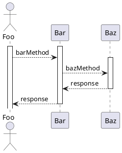
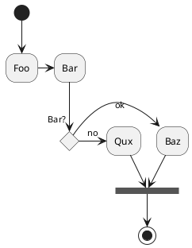
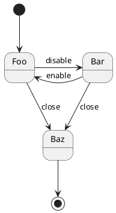
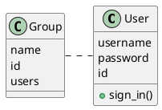

# Visual Studio Code + Markdown Preview Enhancedはチームでデファクト化したいMarkdown環境だ！、と思う(2017/10月時点)

# 1.Markdown環境の意義

Markdwonは[以前に書いたように](https://qiita.com/kitfactory/items/170c4ea17e8047ea0c95)今後の文書生産性を変えていく可能性のあるツールの一つです。Markdownのメリットは次の点だと思います。（みなさま、もうすでに取り入れられていると思いますが。。。）

## 1.1.Markdownのメリット

* テキスト形式のため、とにかく編集が簡単。
* テキスト形式のため、変更差分の管理が容易である。
* テキスト形式のため、各種プログラムによる処理/自働化に馴染みやすい。

そして、Markdownを一度、使い始めてしまうと、あそこがこうなれば良いと、色々やりたいことが出て来ると思います。その痒いところに手がとどく環境が急速に環境が整いつつあります。チームで統一した環境を揃えていくとメリットが出る状況でないかと感じています。

# 2. Visual Studio Code + Markdwon Preview Enhancedの紹介

2017.10月時点で何を使うべきかということになるのですが、個人的にはVisual Studio Code(VSCode)＋Markdown Preview Enhanced(プラグイン)を推薦したいと思います。

Markdown Preview Enhancedは、もともとAtomエディタにも提供されているプラグインですが、VSCodeにもβ版が提供されるようになっています。Atomには膨大なプラグインがあって高度なことがたくさん出来るのですが、VSCodeは**何よりAtomではモッサリしていたのが軽快になるのが素晴らしいのです。** 

とはいえ、**エディタ宗教論争を巻き起こしたいわけではない**ので、皆さんは皆さんの用途やプロジェクトの環境をにあったものを使用していただければとは、お断りしておきます。あくまで世の中では、これくらいのことが出来るようになってきたとご参考にしていただければ幸いです。

## 2.1.Markdown Preview Enhancedのインストール

すでにVS Codeのプラグインとして提供されているので、通常のプラグインインストール手順でインストールできます。

# 3.Markdown Preview Enhancedで出来るようになること。

Markdown Preview EnhancedはMarkdownを大きく機能拡張します。今まででは信じられないようなパワーをテキスト編集に与えてくれます。

## 3.1.できること：様々なUML図を描画する。(PlantUML連携)

Markdown Preview Enhancedを使うとPlantUMLとの連携が可能になります。



**アクテビティ図**


**ステート図**


**クラス図**


## 3.2.できること：様々な数式を描画する。

数式を記載することも可能です。

$\sum_{n=1}^{100}foo(n)+bar(n^2)$

## 3.3.できること：CSV表のインポート。

表形式をマークダウンで維持管理することは大変です。atomであればtablrというプラグインがありますが、使い勝手でもまだ問題あるかなと感じます。CSVファイルは残念ながら別途エクセルで管理するとし、Markdown Preview Enhancedで取り込んでしまうのが良いのではないかと考えます。（どなたかCSVファイルのプラグインを書いてくださると嬉しい。）

Markdown Preview Enhancedではimport文が使用でき、さまざまなフォーマットのファイルが使用できます。

```
@import "test.csv"

```

## 3.4.できること：別フォーマットでのエクスポート

HTMLファイルでエクスポートすることも簡単です。


# 4.さらに使いこなして爆速化する。

## 4.1.スニペットで加速する -1-:図のテンプレート

以下のようなスニペットをエディタに記載させてみましょう。そうすると様々な図形の書式を記憶をしておく必要がなく、爆速を引き出すことができます。


## 4.2.スニペットで加速する -2-:業務のテンプレート

議事録の報告書ようなものはテンプレートでチーム共有をすると、業務の品質が定形化し加速することが期待できます。(良さそうなアイデアがあれば教えて欲しいです。)

**議事録**
```
## xxxx議事録
**日時:** 2017/x/x xx:xx-xx:xx
**参加者:** xxx,xxx,

---
### 1.目的
* xxxxの対応を決める。
* xxxxの対応を決める。

### 2.結論
* xxxxをxxxとする。
* xxxxをxxxとする。

### 3.A.I.
* xxxxxする。(担当: xxx 期日： x/xまで)
* xxxxxする。(担当: xxx 期日： x/xまで)
* xxxxxする。(担当: xxx 期日： x/xまで)

### 4.議論
* xxxxはxxxではないか？(Aさん)
→ xxxにする。

```

## 4.3.プレビューのスタイルシートをカスタマイズする。

Preview側のフォントサイズが気にくわないなど、Preview側の表示を変更することもあるでしょう。VS CodeのコマンドパレットからMarkdown Enhanced Preview : Cutomize CSSを選択することでCSSを編集することができます。


# 5.まとめ

まとめます。

* **Markdownは今後の業務の生産性を革新をするツールの一つで、現在、猛烈な速度で機能拡張されています。**
* **Markdownの拡張機能までチーム内で統一して利用する**ことで、更に生産性向上を期待できます。
* **スニペットまでチームで統一する**ことで、さらなる業務の高速化、作成物の品質安定が期待できます。


[help](http://yohshiy.blog.fc2.com/blog-entry-153.html)