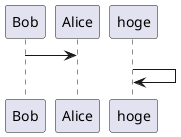

＃ Phycology of Software Project

# ソフトウェアプロジェクトの心理学

# 

##  デザイン
## ナッジ

# 設計

# 慣習

# ツール

## 仕事のタイプ

プロジェクトの中では様々な人に出会う。

・言われたこともできない。
・言われたことができる。
・問題に飛び込み、任せると解決してくれる。

３番目のような人材はとても貴重であるが、それほどいるものでもない。言われたことができないタイプの人にはやっかいなものである。
--------------------------------------------------------------------
・自分の強みは技術レベルでの牽引を通すこと。
・観察による

・チームへのCollective Ownershipを育む、チーム育成。
　自分の言われたことをするための
　その壁を意識させることを通じた人材育成と仕組みづくりです。

## Collective Ownershipを産む場に変える

全体の目標を見えるようにする。

A:

