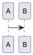

# タイトル：This is Lean: Resolving the Efficiency Paradox
## 著者：Modig, Niklas.  
## Rheologica Publishing
## 気になった言葉
*
*
*

## 論旨
### プロローグ 500倍高速なケア診療
* アリソンとサラの対比による500倍高速な診療。(アリソンは42日間、サラは２時間。)どうちがうのだろう。

### 第１章：リソース・フォーカスから顧客フォーカスに。

* リソース効率性とは、伝統的な効率性の形式、リソースを最大限に使用することを含む。
* リソース効率性は特定期間にどれだけのリソースが利用されているかで計測される。
* フロー効率性はどれだけのユニットが特定の期間に処理されるかで計測される。
* サラが体験したフローがそうである。フロー効率性はニーズを充足する。
* フロー効率性はすべての付加価値のないシーンを取り除き、全ての付加価値のあるシーンを取り出した時短ムービーを編集することだ。

## 第3章　何がプロセスを流れないようにしているか

フロー効率性を達成させるのを妨げている法則。

* リトルの法則
* ボトルネックの法則
* バリエーションの法則

Flow efficiency is a measurement of how much a flow unit is processed during a specific time period.

Flow efficiency is about deleting all the non-value-added clips, then taking all the value-added clips and editing them into a short action movie.

## 第4章　効率のパラドックス

多くの組織ではフロー効率性よりリソース効率性を重視している。高いリソースの利用率は企業に取って望ましいだけでなく主要な目的に見えるためである。

しかし、フロー効率性の高い組織は顧客の観点だけでなく、企業や従業員の観点でも負の効果が見られる。３つの非効率の源から生まれる。

### 長いスループット時間
アリソンの例では42日間の診療にかかったが、その間に人を替えるにしろ新しい必要性を生み出してしまう。待ち時間は機会の窓を閉じてしまう。

### 多くのフロー・ユニット
###

非効率

Modig, Niklas. This is Lean: Resolving the Efficiency Paradox (Kindle の位置No.336-337). Rheologica Publishing. Kindle 版.

Satifying needs.

Resource efficiency, the traditional form of efficiency, involves utilizing resources as much as possible.

https://stg-s01.epson.biz/meteor-portal/portalindex.html

---

# タイトル：幸福の習慣
## 著者：
## 気になった言葉
*
*
*

## 論旨
###  1章　幸せ研究の基礎を知る
* 幸福の測り方
- 幸せは長生き
- 幸せはお金？（ある程度まで）
- 結婚・死別 ＞ 未婚 ＞ 離婚

フォーカシング・イリュージョン
人間 の 愚か な 特性 を うまい 言葉 で 言い当て た のが、 プリンストン大学 名誉教授で ノーベル 経済学 賞 受賞 者 でも ある ダニエル・カーネマン です。 　 その 言葉 とは「 フォーカシング・イリュージョン」。 　 フォーカシング

前野隆司. 幸せのメカニズム　実践・幸福学入門 (講談社現代新書) (Kindle の位置No.533-536).  . Kindle 版.

### 2章
*

---
# タイトル：
## 著者：大野耐一
## 気になった言葉  
*
*
*

## 論旨
###  1章
*

### 2章
*

---
# タイトル：
## 著者：
## 気になった言葉
*
*
*

## 論旨
###  1章
*

### 2章
*

---
# タイトル：Clean Architecture
## 著者：Robert C. Martin
## 気になった言葉
*
*

## 論旨
###  1章:Introduction
* 何かを正しくすることは全くの別物。
　ソフトウェアを正しくすることはとても困難だ。

### 2章
 

Part I: Introduction 1

 

### Chapter 1: What Is Design and Architecture? 3

#### The Goal?
> The gal of software architecture is to minimize the human resources required to build and maintain the required system.

####Case Study
#### Conclusion
アーキテクチャの重要性の説明。
 

### Chapter 2: A Tale of Two Values
#### Behavior
#### Architecture
#### The Greater Value
#### Eisenhower’s Matrix
#### Fight for the Architecture

 

Part II: Starting with the Bricks: Programming Paradigms 19

 

Chapter 3: Paradigm Overview 21

Structured Programming 22

Object-Oriented Programming 22

Functional Programming 22

Food for Thought 23

Conclusion 24

 

Chapter 4: Structured Programming 25

Proof 27

A Harmful Proclamation 28

Functional Decomposition 29

No Formal Proofs 30

Science to the Rescue 30

Tests 31

Conclusion 31

 

Chapter 5: Object-Oriented Programming 33

Encapsulation? 34

Inheritance? 37

Polymorphism? 40

Conclusion 47

 

Chapter 6: Functional Programming 49

Squares of Integers 50

Immutability and Architecture 52

Segregation of Mutability 52

Event Sourcing 54

Conclusion 56

 

Part III: Design Principles 57

 

Chapter 7: SRP: The Single Responsibility Principle 61

Symptom 1: Accidental Duplication 63

Symptom 2: Merges 65

Solutions 66

Conclusion 67

 

Chapter 8: OCP: The Open-Closed Principle 69

A Thought Experiment 70

Directional Control 74

Information Hiding 74

Conclusion 75

 

Chapter 9: LSP: The Liskov Substitution Principle 77

Guiding the Use of Inheritance 78

The Square/Rectangle Problem 79

LSP and Architecture 80

Example LSP Violation 80

Conclusion 82

 

Chapter 10: ISP: The Interface Segregation Principle 83

ISP and Language 85

ISP and Architecture 86

Conclusion 86

 

Chapter 11: DIP: The Dependency Inversion Principle 87

Stable Abstractions 88

Factories 89

Concrete Components 91

Conclusion 91

 

Part IV: Component Principles 93

 

Chapter 12: Components 95

A Brief History of Components 96

Relocatability 99

Linkers 100

Conclusion 102

 

Chapter 13: Component Cohesion 103

The Reuse/Release Equivalence Principle 104

The Common Closure Principle 105

The Common Reuse Principle 107

The Tension Diagram for Component Cohesion 108

Conclusion 110

 

Chapter 14: Component Coupling 111

The Acyclic Dependencies Principle 112

Top-Down Design 118

The Stable Dependencies Principle 120

The Stable Abstractions Principle 126

Conclusion 132

 

Part V: Architecture 133

 

Chapter 15: What Is Architecture? 135

Development 137

Deployment 138

Operation 138

Maintenance 139

Keeping Options Open 140

Device Independence 142

Junk Mail 144

Physical Addressing 145

Conclusion 146

 

Chapter 16: Independence 147

Use Cases 148

Operation 149

Development 149

Deployment 150

Leaving Options Open 150

Decoupling Layers 151

Decoupling Use Cases 152

Decoupling Mode 153

Independent Develop-ability 153

Independent Deployability 154

Duplication 154

Decoupling Modes (Again) 155

Conclusion 158

 

Chapter 17: Boundaries: Drawing Lines 159

A Couple of Sad Stories 160

FitNesse 163

Which Lines Do You Draw, and When Do You Draw Them? 165

What About Input and Output? 169

Plugin Architecture 170

The Plugin Argument 172

Conclusion 173

 

Chapter 18: Boundary Anatomy 175

Boundary Crossing 176

The Dreaded Monolith 176

Deployment Components 178

Threads 179

Local Processes 179

Services 180

Conclusion 181

 

Chapter 19: Policy and Level 183

Level 184

Conclusion 187

 

Chapter 20: Business Rules 189

Entities 190

Use Cases 191

Request and Response Models 193

Conclusion 194

 

Chapter 21: Screaming Architecture 195

The Theme of an Architecture 196

The Purpose of an Architecture 197

But What About the Web? 197

Frameworks Are Tools, Not Ways of Life 198

Testable Architectures 198

Conclusion 199

 

Chapter 22: The Clean Architecture 201

The Dependency Rule 203

A Typical Scenario 207

Conclusion 209

 

Chapter 23: Presenters and Humble Objects 211

The Humble Object Pattern 212

Presenters and Views 212

Testing and Architecture 213

Database Gateways 214

Data Mappers 214

Service Listeners 215

Conclusion 215

 

Chapter 24: Partial Boundaries 217

Skip the Last Step 218

One-Dimensional Boundaries 219

Facades 220

Conclusion 220

 

Chapter 25: Layers and Boundaries 221

Hunt the Wumpus 222

Clean Architecture? 223

Crossing the Streams 226

Splitting the Streams 227

Conclusion 228

 

Chapter 26: The Main Component 231

The Ultimate Detail 232

Conclusion 237

 

Chapter 27: Services: Great and Small 239

Service Architecture? 240

Service Benefits? 240

The Kitty Problem 242

Objects to the Rescue 244

Component-Based Services 245

Cross-Cutting Concerns 246

Conclusion 247

 

Chapter 28: The Test Boundary 249

Tests as System Components 250

Design for Testability 251

The Testing API 252

Conclusion 253

 

Chapter 29: Clean Embedded Architecture 255

App-titude Test 258

The Target-Hardware Bottleneck 261

Conclusion 273

 

Part VI: Details 275

 

Chapter 30: The Database Is a Detail 277

Relational Databases 278

Why Are Database Systems So Prevalent? 279

What If There Were No Disk? 280

Details 281

But What about Performance? 281

Anecdote 281

Conclusion 283

 

Chapter 31: The Web Is a Detail 285

The Endless Pendulum 286

The Upshot 288

Conclusion 289

 

Chapter 32: Frameworks Are Details 291

Framework Authors 292

Asymmetric Marriage 292

The Risks 293

The Solution 294

I Now Pronounce You … 295

Conclusion 295

 

Chapter 33: Case Study: Video Sales 297

The Product 298

Use Case Analysis 298

Component Architecture 300

Dependency Management 302

Conclusion 302

 

Chapter 34: The Missing Chapter 303

Package by Layer 304

Package by Feature 306

Ports and Adapters 308

Package by Component 310

The Devil Is in the Implementation Details 315

Organization versus Encapsulation 316

Other Decoupling Modes 319

Conclusion: The Missing Advice 321

 

Part VII: Appendix 323

Appendix A Architecture Archaeology 325

 

